# mall — 全栈电商系统


基于 Spring Boot 3 + Vue 3 的 B2C 电商平台，覆盖用户注册登录、商品浏览、购物车、下单、支付全流程，并内置高并发秒杀系统。

## 在线体验

- **用户门户（商城前台）**：https://mall.qiujie.net.cn
- **管理后台（运营端）**：https://mall.qiujie.net.cn/admin/
- **默认测试账号**：用户名 `admin` / 密码 `123456`（登录页已预填）

## 项目介绍

| 模块 | 说明 | 技术栈 | 端口 |
|------|------|--------|------|
| **mall-server** | 后端服务，REST API | Spring Boot 3.2.5 + MyBatis-Plus + MySQL + Redis + RabbitMQ + Elasticsearch + Sa-Token | 8800 |
| **mall-admin** | 管理后台前端 | Vue 3.4 + Element Plus + Pinia + ECharts + UnoCSS | 3002 |
| **mall-portal** | 用户门户前端 | Vue 3.4 + Element Plus + Pinia | 3001 |

> 支付为**模拟支付**：订单提交后本地生成支付流水号，未接入真实第三方支付渠道。

## 核心亮点

- ⚡ **秒杀高并发方案**：Redis Lua 脚本原子扣减库存防超卖；RabbitMQ 消息削峰异步下单；消费失败自动重试（最多 3 次），超限回滚库存；用户级防重与消费幂等
- ⏰ **订单超时取消双保险**：RabbitMQ 延迟队列（TTL 10 分钟）到期自动取消订单并恢复库存，前端倒计时轮询兜底
- 🔍 **Elasticsearch 商品搜索**：商品文档同步 + 定时增量同步任务，关键词/分类检索
- 🔐 **认证与安全**：Sa-Token 双端登录态隔离、同端互踢（同账号新登录踢掉旧会话）；`@RateLimit` 注解 + Redis 滑动窗口限流；Redisson 分布式锁；布隆过滤器防缓存穿透
- 🗄 **多级缓存**：Redis + Caffeine 本地缓存，首页、商品、秒杀场次等热点数据自动缓存与失效
- 📊 **管理看板**：ECharts 数据可视化——销售趋势、分类销量 TOP5、订单状态概览
- 📁 **Excel 导入导出**：基于 POI 的注解式表格导入导出

## 页面截图

### 用户门户（mall-portal）

| 首页 | 商品分类 | 商品详情 |
|------|---------|---------|
| 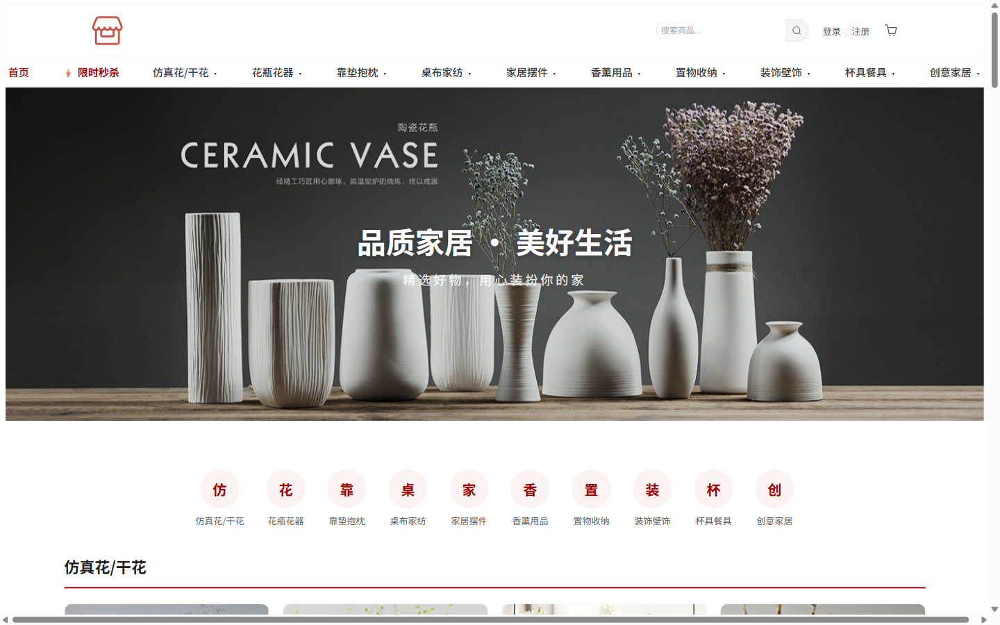 |  | 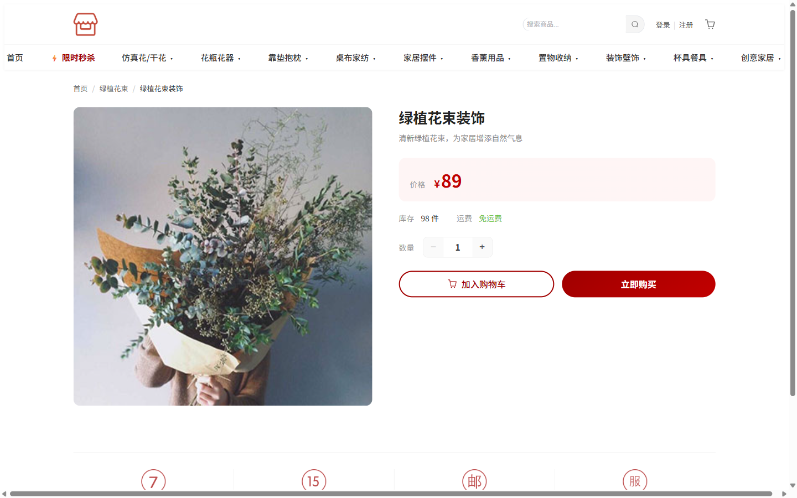 |

| 限时秒杀 | 购物车 | 订单列表 |
|---------|--------|---------|
| 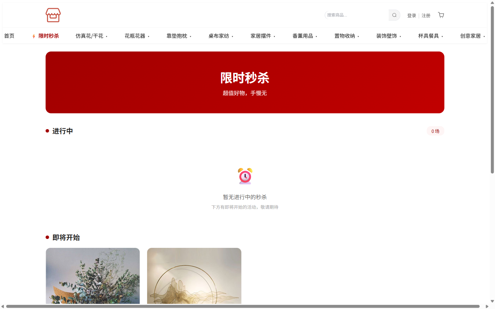 | 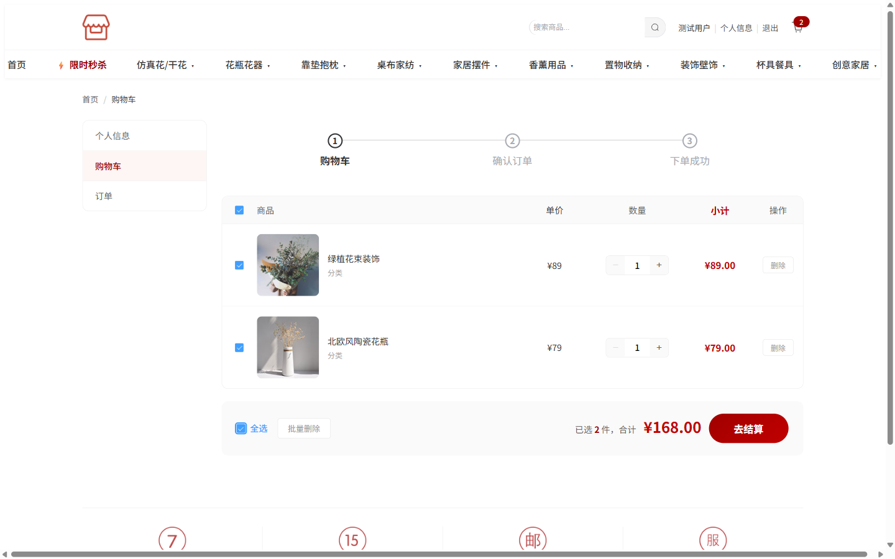 | 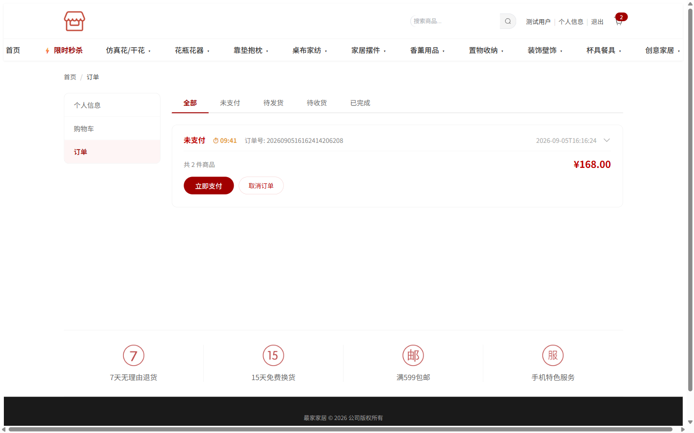 |

### 管理后台（mall-admin）

| 数据看板 | 商品管理 |
|---------|---------|
| 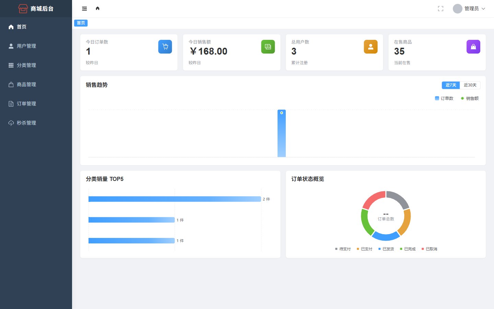 | 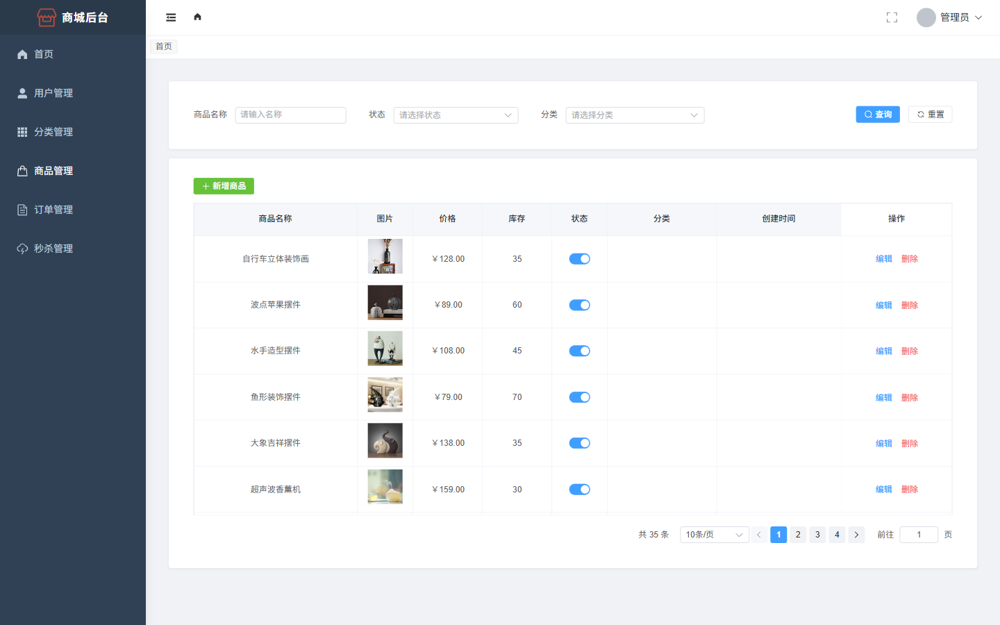 |

| 订单管理 | 秒杀管理 |
|---------|---------|
| 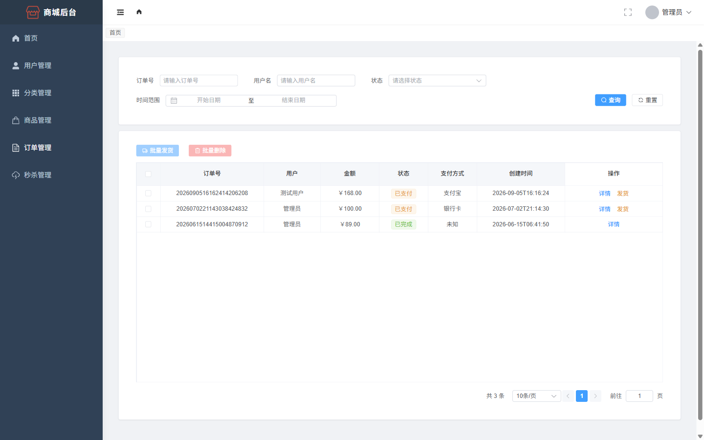 | 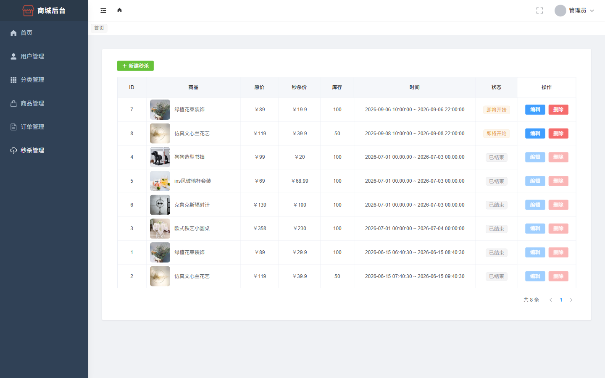 |

## 核心业务流程

### 普通购物流程

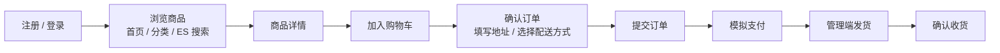

### 秒杀流程

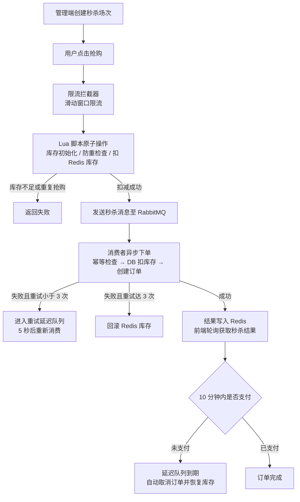

## 技术栈

### 后端（mall-server）

| 技术 | 版本 | 用途 |
|------|------|------|
| Spring Boot | 3.2.5 | 基础框架（Java 17） |
| MyBatis-Plus | 3.5.5 | ORM 数据访问 |
| MySQL | 8.0 | 关系数据库（Druid 连接池） |
| Redis | 7 | 缓存 / 分布式锁 / 限流 / 秒杀库存 |
| RabbitMQ | 3 | 秒杀异步下单 / 订单超时取消 |
| Elasticsearch | 7.17 | 商品全文搜索 |
| Sa-Token | 1.39 | 双端认证 / 会话管理 |
| Redisson | 3.24 | 分布式锁 |
| springdoc-openapi | 2.3 | API 文档（Swagger UI） |

### 前端

| 技术 | mall-admin | mall-portal |
|------|-----------|-------------|
| Vue | 3.4 | 3.4 |
| Element Plus | 2.5 | 2.5 |
| Pinia | ✅ | ✅ |
| Vue Router | ✅ | ✅ |
| ECharts | ✅ | — |
| UnoCSS | ✅ | — |
| Vite | 5 | 5 |

## 系统架构图

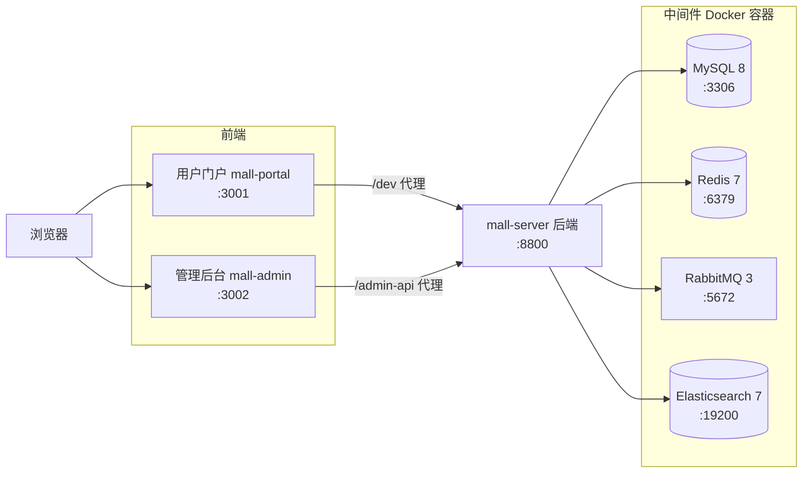

## 目录结构

```
mall/
├── db/                           # 数据库 SQL（初始化 / 导出）
├── img/                          # 图片资源目录
│   └── readme/                   # README 页面截图
├── docker/
│   └── local/                    # 本地开发编排（docker-compose.yml，一键拉起 MySQL/Redis/RabbitMQ/ES）
├── mall-server/                  # 后端服务（Spring Boot 3）
│   ├── src/main/java/com/qiujie/
│   │   ├── controller/           # 接口层（admin/ 管理端、portal/ 门户端）
│   │   ├── service/              # 业务层
│   │   ├── mapper/               # 数据层（MyBatis-Plus）
│   │   ├── entity/ dto/ vo/ enums/   # 实体 / 传输对象 / 枚举
│   │   ├── config/               # Sa-Token、Redis、RabbitMQ、OSS 等配置
│   │   ├── mq/                   # 消息监听（秒杀下单、订单超时取消）
│   │   ├── interceptor/          # 限流拦截器
│   │   ├── job/                  # 定时任务（ES 增量同步）
│   │   └── util/                 # Redis 工具、缓存客户端、布隆过滤器等
│   └── src/main/resources/       # 配置文件与 Mapper XML
├── mall-admin/                   # 管理后台前端（Vue 3，端口 3002）
│   ├── src/api/                  # 接口封装
│   ├── src/stores/               # Pinia 状态管理
│   ├── src/router/               # 路由
│   ├── src/views/                # 页面（商品 / 订单 / 用户 / 分类 / 秒杀 / 看板）
│   └── src/components/           # 公共组件
└── mall-portal/                  # 用户门户前端（Vue 3，端口 3001）
    ├── src/api/                  # 接口封装
    ├── src/stores/               # Pinia 状态管理
    ├── src/router/               # 路由
    ├── src/views/                # 页面（首页 / 商品 / 秒杀 / 购物车 / 订单等）
    └── src/components/           # 公共组件
```

## 本地启动

### 前置要求

- JDK 17+、Maven 3
- Node.js 18+、npm
- Docker（中间件统一由 Docker 容器提供，无需本机安装 MySQL/Redis 等）

### 1. 启动中间件

```bash
docker compose -f docker/local/docker-compose.yml up -d
```

首次启动 MySQL 会自动执行 `db/mall.sql` 初始化库表和种子数据。

### 2. 启动后端（端口 8800）

```bash
cd mall-server
./mvnw spring-boot:run -Dspring-boot.run.profiles=dev -Dspring-boot.run.arguments=--spring.amqp.deserialization.trust.all=true
```

**需要配置的环境变量**：

| 变量 | 说明 |
|------|------|
| `OSS_ACCESS_KEY_ID` | 阿里云 OSS AccessKey ID |
| `OSS_ACCESS_KEY_SECRET` | 阿里云 OSS AccessKey Secret |

> 这两个变量必须设置，否则服务无法启动；设置任意值即可正常启动和浏览，但**图片上传功能需要真实密钥**。中间件连接配置已内置在 `application-dev.yml` 中，无需额外配置。

### 3. 启动管理后台（端口 3002）

```bash
cd mall-admin
npm install
npm run dev
```

访问：http://localhost:3002/admin/

### 4. 启动用户门户（端口 3001）

```bash
cd mall-portal
npm install
npm run dev
```

访问：http://localhost:3001

### 其他入口

- API 文档（Swagger UI）：http://localhost:8800/swagger-ui/index.html
- 健康检查：http://localhost:8800/actuator/health

## 默认账号

| 端 | 用户名 | 密码 | 说明 |
|----|--------|------|------|
| 管理端 | `admin` | `123456` | 管理员，登录框已预填 |
| 门户端 | `user` | `123456` | 测试用户（也可用 admin 登录门户） |

## 交流群

欢迎加入 QQ 交流群：**967925576**
